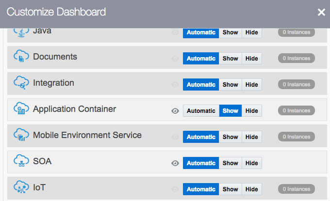

Updated: December 10, 2018

## Introduction

This lab guide will walk you through the process of logging into your Oracle Cloud Account.

## Objectives
- Login to your Oracle Cloud Account.

## Required Artifacts
- Oracle Cloud Account with Autonomous Data Warehouse Cloud Service

### **STEP 1**: Login to your Oracle Cloud Account.

- From any browser, go to the URL:
    `https://cloud.oracle.com`

- click **Sign In** in the upper right hand corner of the browser

    

- **IMPORTANT** - Under my services, select from the drop down list the correct data center and click on **My Services**. If you are unsure of the data center you should select, and this is an in-person training event, ***ask your instructor*** which **Region** to select from the drop down list. If you received your account through an Oracle Trial, your Trial confirmation email should provide a URL that will pre-select the region for you.

    

- Enter your identity domain and click **Go**.

    **NOTE:** The **Identity Domain, User Name** and **Password** values will be given to you by the instructor or Trial confirmation email.

    

- Once your Identity Domain is set, enter your User Name and Password and click **Sign In**

 
- You will be presented with a Dashboard displaying the various cloud services available to this account.

    

- If all your services are not visible, **click** on the **Customize Dashboard**, you can add services to the dashboard by clicking **Show.** For this workshop, you will want to ensure that you are showing at least the **Autonomous Data Warehouse and Compute** cloud services. If you do not want to see a specific service, click **Hide**

    
             