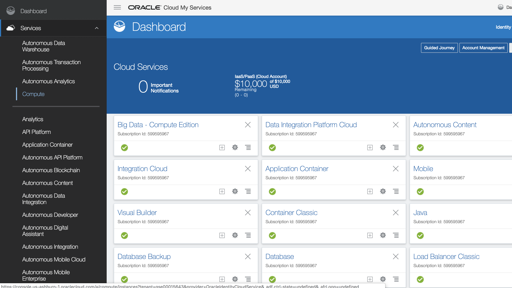
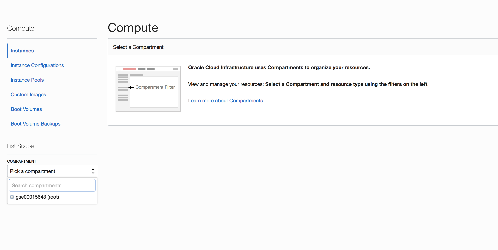
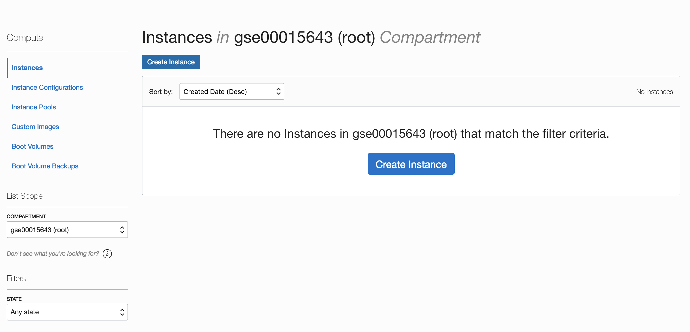
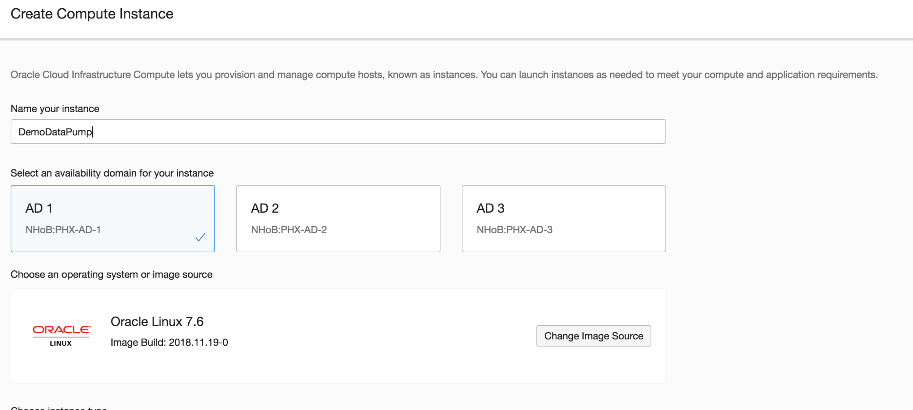
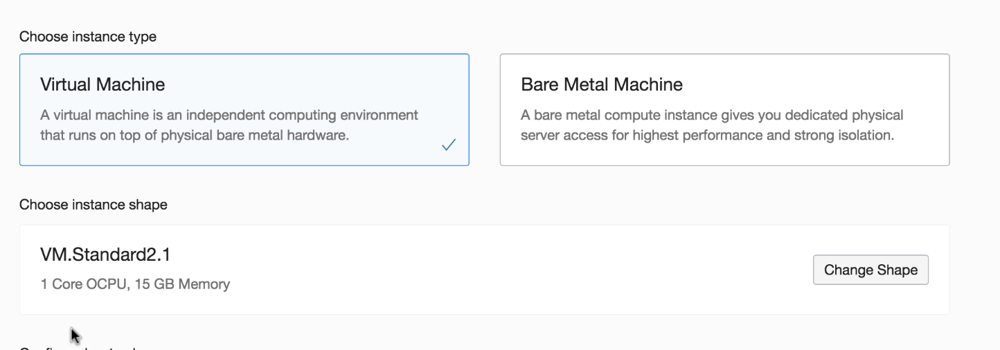
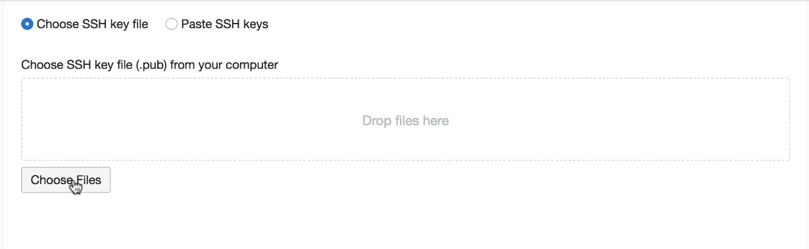
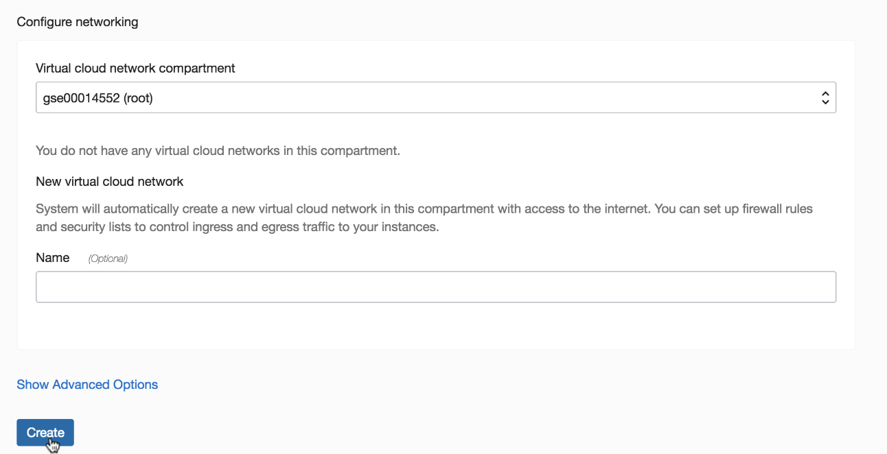
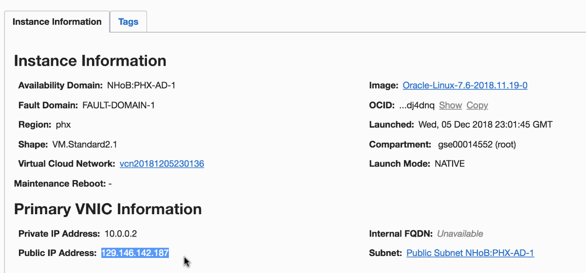

Updated: December 10, 2018

## Introduction

This lab guide will walk you through the process of creating a Compute Linux Instance.

**_To log issues_**, click here to go to the [github oracle](https://github.com/oracle/learning-library/issues/new) repository issue submission form.

## Objectives

- Create a compute linux instance.

## Required Artifacts

- An oracle cloud account with Autonomous Data Warehouse Cloud Service.
- A public and private ssh keys.

### **STEP 1**: Create a **Compute Oracle Linux instance**.

- From the Cloud UI dashboard click on the **Compute** service.
    
     
   
- Select a compartment by clicking on **Pick a compartment**.
    
    

- Click on **Create Instance**.
    
    
    
- Give an **instance name** and select the **availability domain**. Keep the **Operating System** as **default** which is **Oracle Linux**.
    
    

- Keep instance type as **Virtual Machine** and let the **instance shape** be **default**.  
    
    

- I am not configuring any boot volume for the demo. Go ahead and upload an **ssh public key** by clicking on **Choose Files**. The format of the file should be **.pub**.
    
    

- Leave everything as default and click on **Create** 
    
    

- Once the instance is created, click on the instance name and note down the **public IP address.**

    

