Updated: December 10, 2018

## Introduction

This lab guide will walk you through the process of configuring a Compute Linux Instance for Datapump.

**_To log issues_**, click here to go to the [github oracle](https://github.com/oracle/learning-library/issues/new) repository issue submission form.

## Objectives

- Download Instant Client.
- Transfer files to Compute instance.
- Login to Linux instance from command prompt.
- Unzipping packages.
- Configuring environmant variables.

## Required Artifacts

- An oracle cloud account with Autonomous Data Warehouse Cloud Service.
- FileZilla or any SFTP software for windows.

### **STEP 1**: Download Instant Client.

In this step you will download **Instant Client** for ADWC.

- Go to this link : https://www.oracle.com/technetwork/database/database-technologies/instant-client/overview/index.html
    
  Click on **Downloads**.

  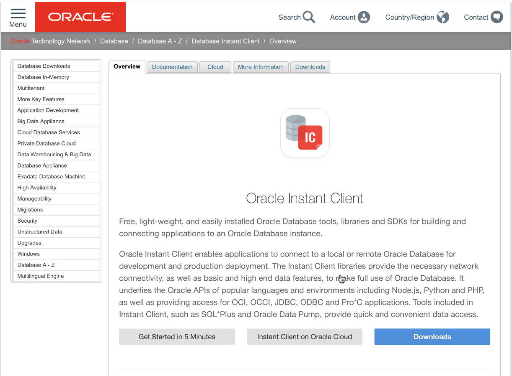    

- Select **Instant Client for Linux x86-64**. Click on **Accept Licence Agreement**. Navigate to **Version 18.3.0.0.0** section, then under **Base - one of these packages is required** section, click on **instantclient-basic-linux.x64-18.3.0.0.0dbru.zip**. It will download this package. Under **Tools - optional packages** section, click on **instantclient-tools-linux.x64-18.3.0.0.0dbru.zip**. This will download the package required for data pump.

  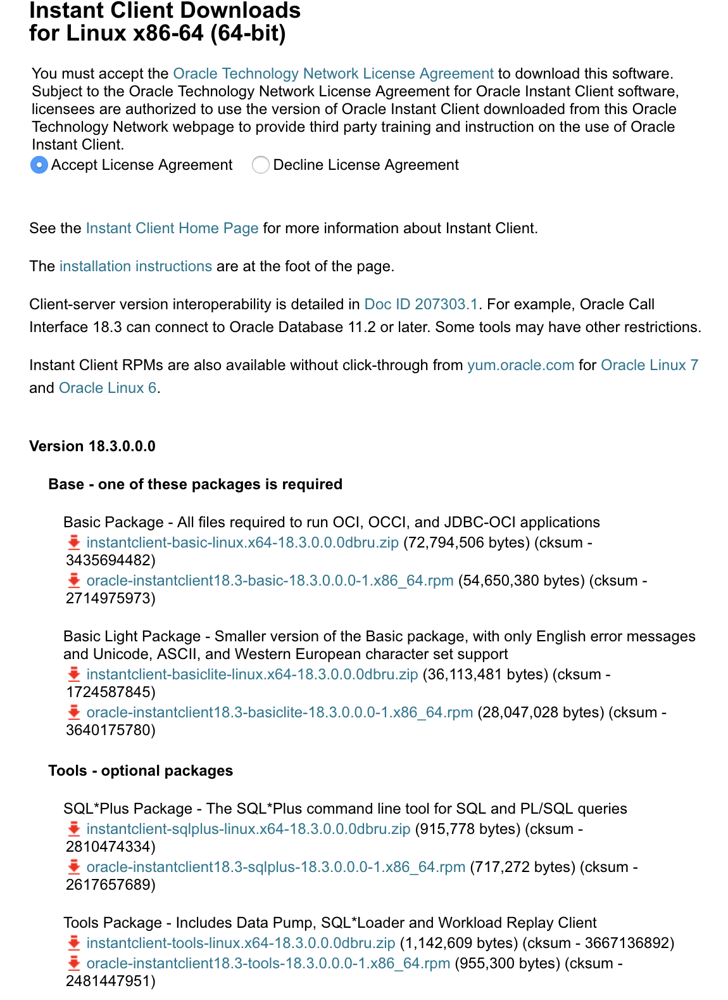

- For quick access, copy paste both the zip files to **DemoADWC** directory that you have created in Lab 2. 
    
### **STEP 2**: Transfer files to Compute instance.

- Go to your Oracle Cloud console. Click on your compute Linux instance and jot down the public IP address of the instance.  
    
    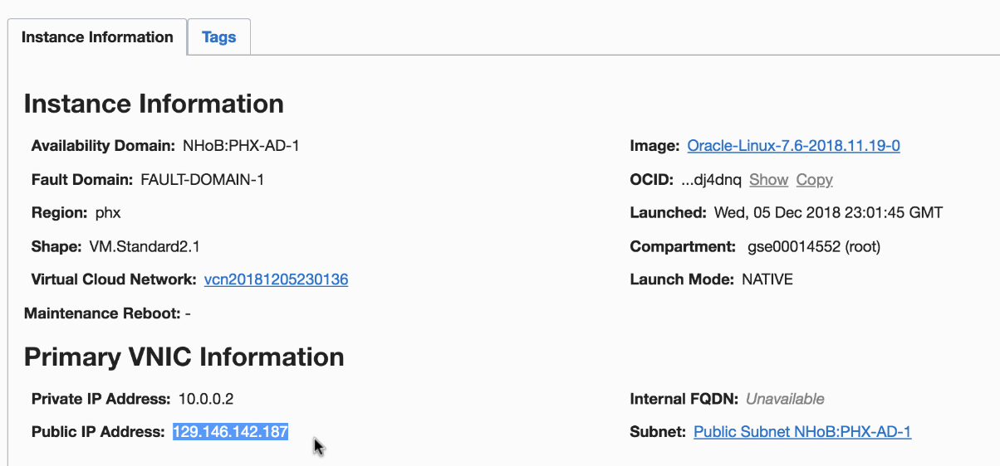

- **For Mac users**: We will transfer a few files to the compute instance. 
  Navigate to the **DemoADWC** directory where you have downloaded the wallet and instant client. 
  
  Type the following command from the command line:
 
  **scp -i {your folder location}/{wallet file name}.zip opc@{IP address}:{wallet file name}.zip**
  
  **scp -i {your folder location}/{instantclient basic package file name}.zip opc@{IP address}:{instantclient basic package file name}.zip**
  
  **scp -i {your folder location}/{instantclient tool package file name}.zip opc@{IP address}:{instantclient tool package file name}.zip**
    
- **For windows user**: Open any SFTP software. I am using FileZilla, so I will explain the steps through FileZilla.
  Click on **FileZilla** and then **Settings**. 
    
    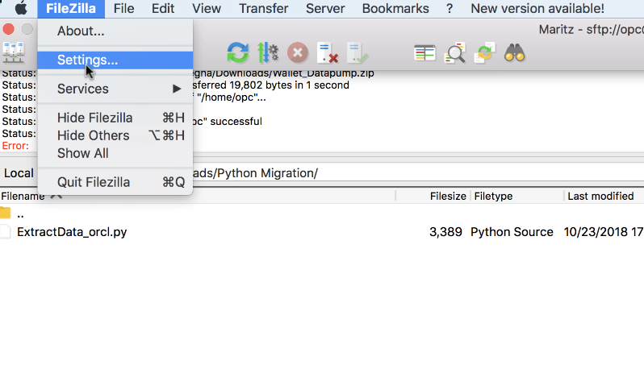
    
- under **Connections**, click on **SFTP** . Upload your private key by clicking on **Add key file...**

    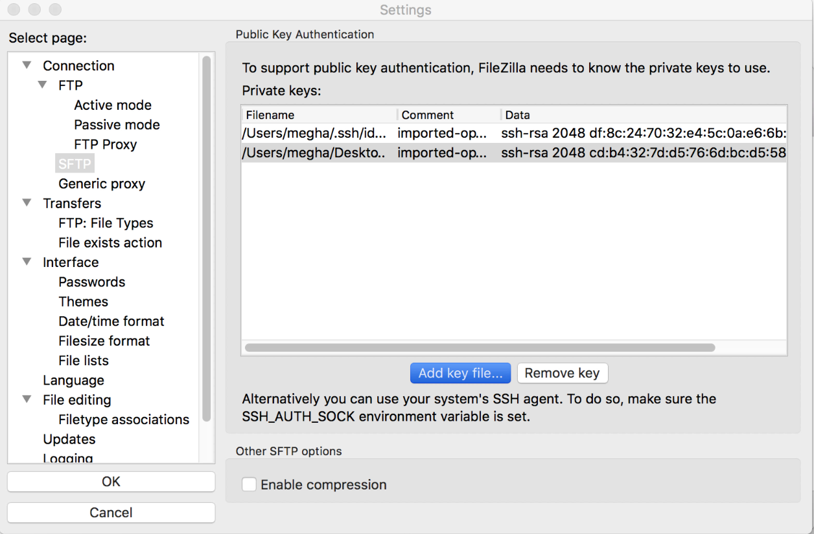
    
- Click on **File**, and **Site Manager**.

    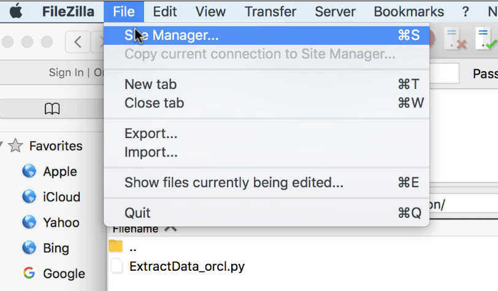
    
- Click on **New Site** and name it as **DataPump**. Select **Protocol** as **SFTP**. Enter the Compute's **Public IP Address** in **Host**. Enter **opc** as **User**. Leave **Password** blank and Click on **Connect**.

    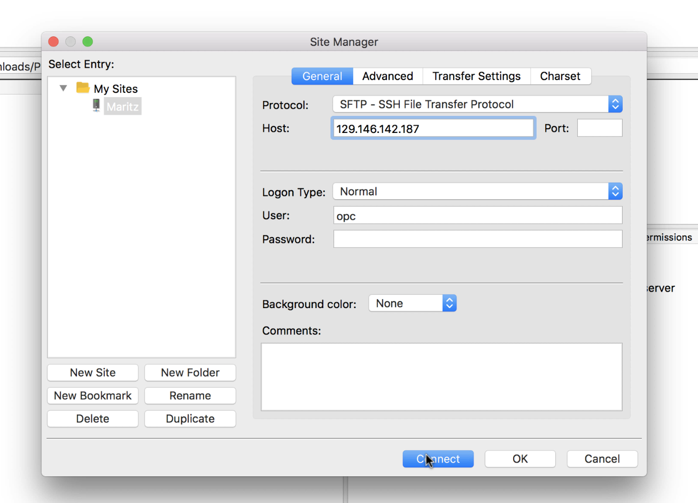

- A pop-up of **Unknown host key** will appear. Click on **Always trust this host...** and click **Ok**.

    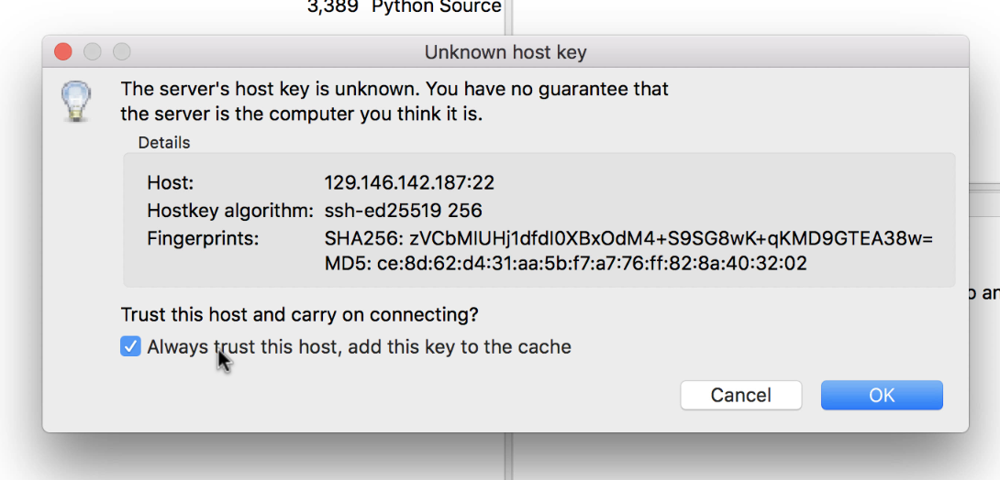    

- Make sure that you are connected to the instance. Look at the top-left, status should show **Connected to (Your IP Address)**
    
    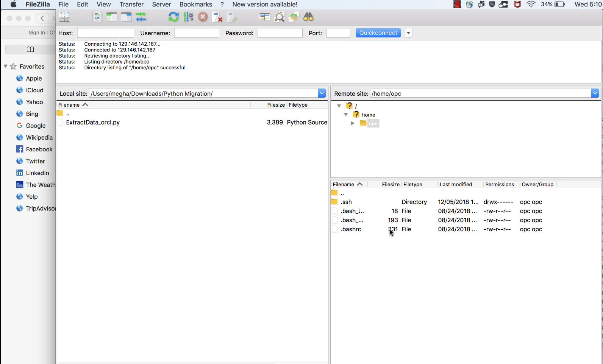
 
- Drag and drop **zip format of wallet** (Downloaded in step 4), **instant client basic and tool package** (Downloaded in step 5) to the Linux instance through FIleZilla (Remote site). 

    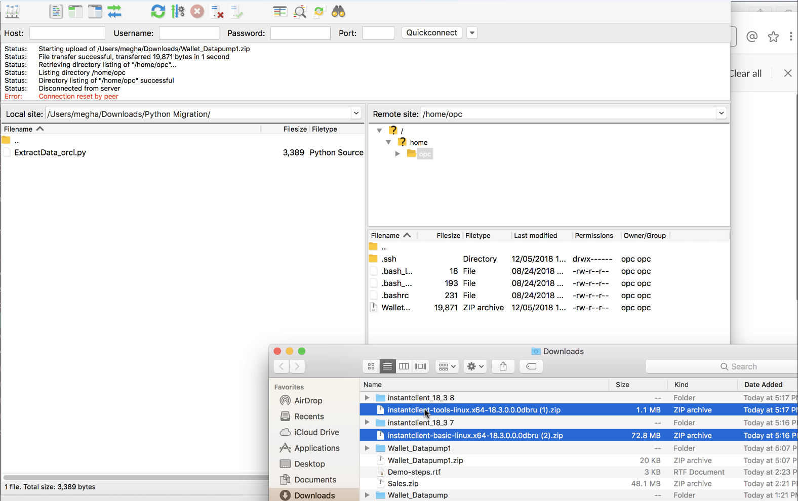
  
### **STEP 3**: Login to Linux instance from command prompt.

- Set these parameters:
    
    - **your_private_key** : The filename of your private key. Make sure that you are in the same folder as your private key or else enter the file path. 
    - **public_ip_address** : Oracle compute's IP address. (The one copied in step 2)
    
    Open a command prompt and type **ssh -i your_private_key opc@public_ip_address**. 
    It will ask **Are you sure you want to continue connections**, type **yes**

    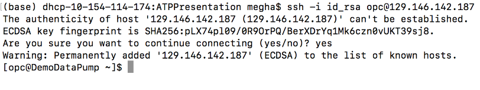
    

### **STEP 4**: Unzip packages.

- After logging in to the compute instance, if you do **ls**, you will be able to see all the zip files that we have transferred. 

- Make a directory called **oracle** by typing the following command **mkdir oracle**. (Check the screenshot below)

- Unzip the basic and tool package in the folder **oracle**. 
  
  Parameters to change in command-  
  **instantclient-basic-package**: instant client basic zip file name.
  **instantclient-tool-package**: instant client tool zip file name.
  
  Type following command in command line: 
  
  **unzip instantclient-basic-package.zip -d oracle/**
  
  **unzip instantclient-tool-package.zip -d oracle/**

  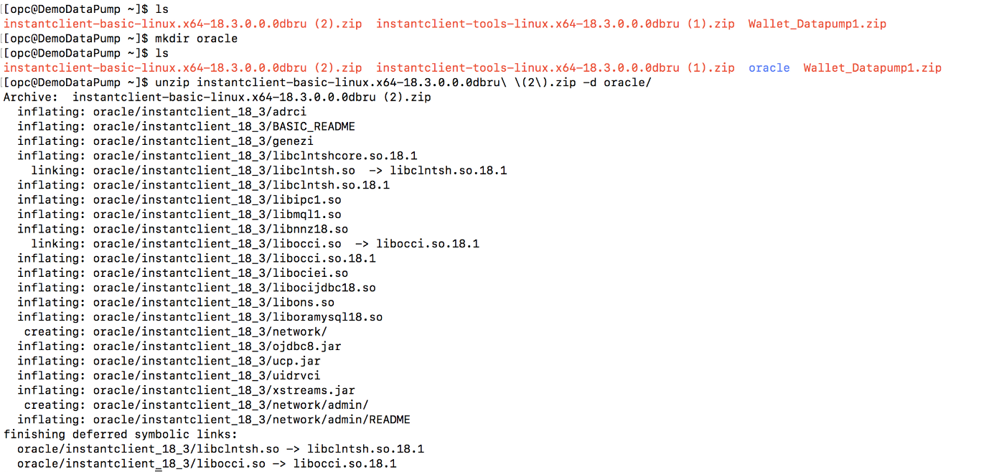
    
- Unzip the wallet in the folder  **/oracle/instantclient_18_3/network/admin** by typing the following in command line:
  
  **unzip wallet_file_name.zip -d /home/opc/oracle/instantclient_18_3/network/admin/**
  
  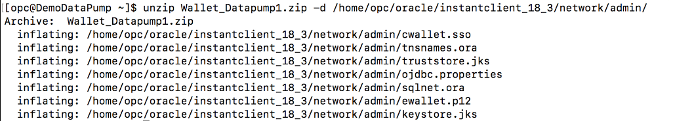
    
### **STEP 5**: Configure environment variables.

- Type following lines in command prompt:

    **export ORACLE_HOME=/home/opc/oracle/instantclient_18_3**

    Makes sure you echo the variable and check if all parameters is set.    
    
    **export LD_LIBRARY_PATH="$ORACLE_HOME""**
    
    **export PATH="$ORACLE_HOME:$PATH"**
       
    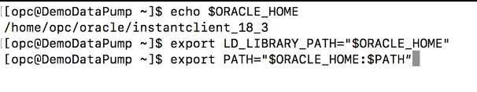 
    
    **export TNS_ADMIN=/home/opc/oracle/instantclient_18_3/network/admin**

- Let's navigate to **/home/opc/oracle/instantclient_18_3** and check if **impdp** is configured

    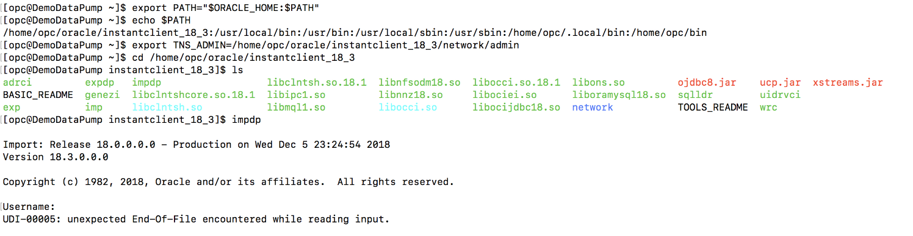
    
 