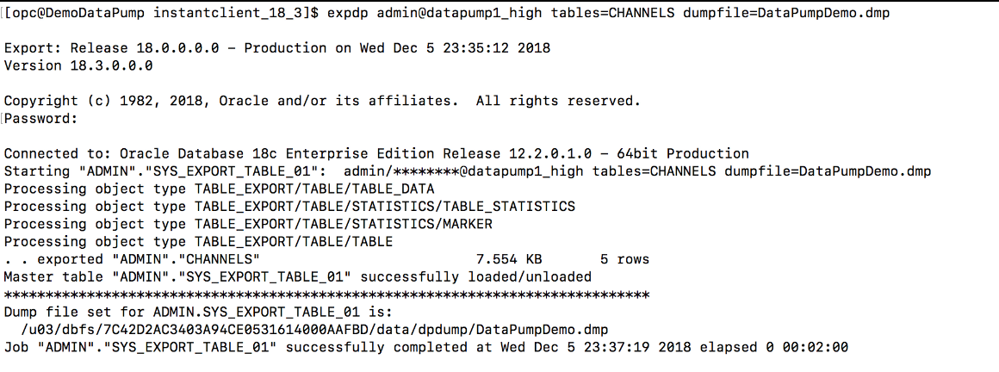
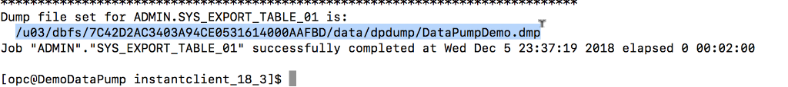

Updated: December 10, 2018

## Introduction

This lab guide will walk you through the process of exporting tables from ADWC through Datapump.

**_To log issues_**, click here to go to the [github oracle](https://github.com/oracle/learning-library/issues/new) repository issue submission form.

## Objectives

- Export a table using expdp, Datapump.

### **STEP 1**: Export a table using expdp, Datapump.

- Makes sure that you are in **/home/opc/oracle/instantclient_18_3**. 

  Note: You can also export schema by mentioning it as a parameter in expdp command. Check the documentation for more details. 
        [Documentation](https://docs.oracle.com/en/cloud/paas/autonomous-data-warehouse-cloud/user/load-data.html#GUID-30DB1EEA-DB45-49EA-9E97-DF49A9968E24)

- Copy paste the command below, but before that, change the following parameter. 

    - **service_name** : `Name of the service, for this demo we are using high`

    **expdp admin@service_name tables=CHANNELS dumpfile=DataPumpDemo.dmp**
  
  You can also give object storage location for dump file. 

    
  
- Make sure to copy paste the **Dump file set location**:

    