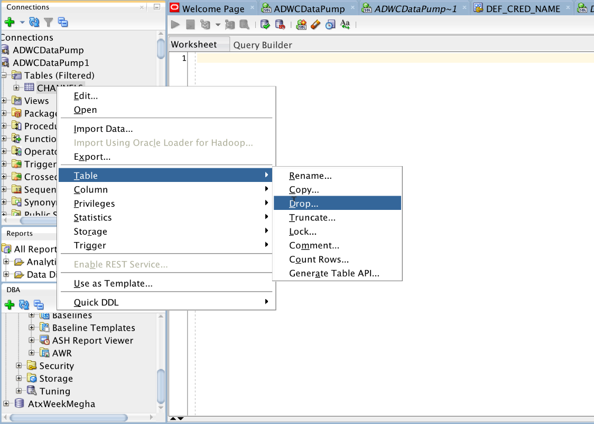
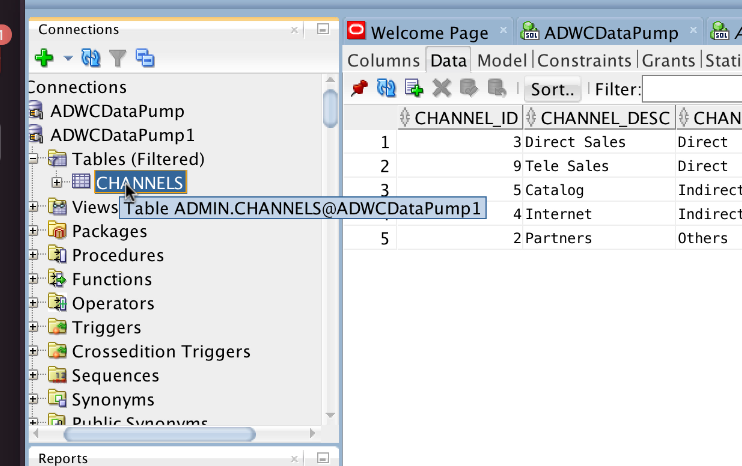

Updated: December 10, 2018

## Introduction

This lab guide will walk you through the process of importing a table in ADWC through Datapump.

**_To log issues_**, click here to go to the [github oracle](https://github.com/oracle/learning-library/issues/new) repository issue submission form.

## Objectives

- Drop a table from ADWC
- Import a table using impdp, Datapump.

###  **STEP 1**: Delete Table from ADWC.

- Go ahead and drop the table **CHANNELS** by right clicking on **CHANNELS** -> **Table** -> **Drop**. 

    

###  **STEP 2**: Import a table using impdp, Datapump.

- Makes sure that you are in **/home/opc/oracle/instantclient_18_3**. 

- You can also import a schema by mentioning another parameter as **schema**.

- Copy paste the command below, but before that, change the following parameter. 

    - **service_name** : `Name of the service, for this demo we are using high`

    - **dumpfile_name** : `Dump file set location`
    
   **impdp admin@service_name directory=data_pump_dir 
   credential=def_cred_name 
   dumpfile=dumpfile_name transform=segment_attributes:n 
   transform=dwcs_cvt_iots:y transform=constraint_use_default_index:y 
   exclude=index, cluster, indextype, materialized_view, materialized_view_log, materialized_zonemap, db_link**   
   
   
   You will be able to see CHANNELS table again 
   
   
 
 ###  **STEP 3**: Import a table using impdp, Datapump through object storage.

- Makes sure that you are in **/home/opc/oracle/instantclient_18_3**. 

- You can also import a schema by mentioning another parameter as **schema**.

- Copy paste the command below, but before that, change the following parameter. 

    - **credential** : `The credential that you have created in lab 200, step 2`

    - **service_name** : `Name of the service, for this demo we are using high`

    - **dumpfile** : `Dump file set location. Here it is the swift url of the file in Object Storage`
    
   **impdp admin@service_name directory=data_pump_dir 
   credential=def_cred_name 
   dumpfile=https://swiftobjectstorage.us-ashburn-1.oraclecloud.com/v1/gse00014638/ETEBucket/DataPumpDemo.dmp transform=segment_attributes:n 
   transform=dwcs_cvt_iots:y transform=constraint_use_default_index:y 
   exclude=index, cluster, indextype, materialized_view, materialized_view_log, materialized_zonemap, db_link**   
   
   
   You will be able to see CHANNELS table again 
   
   